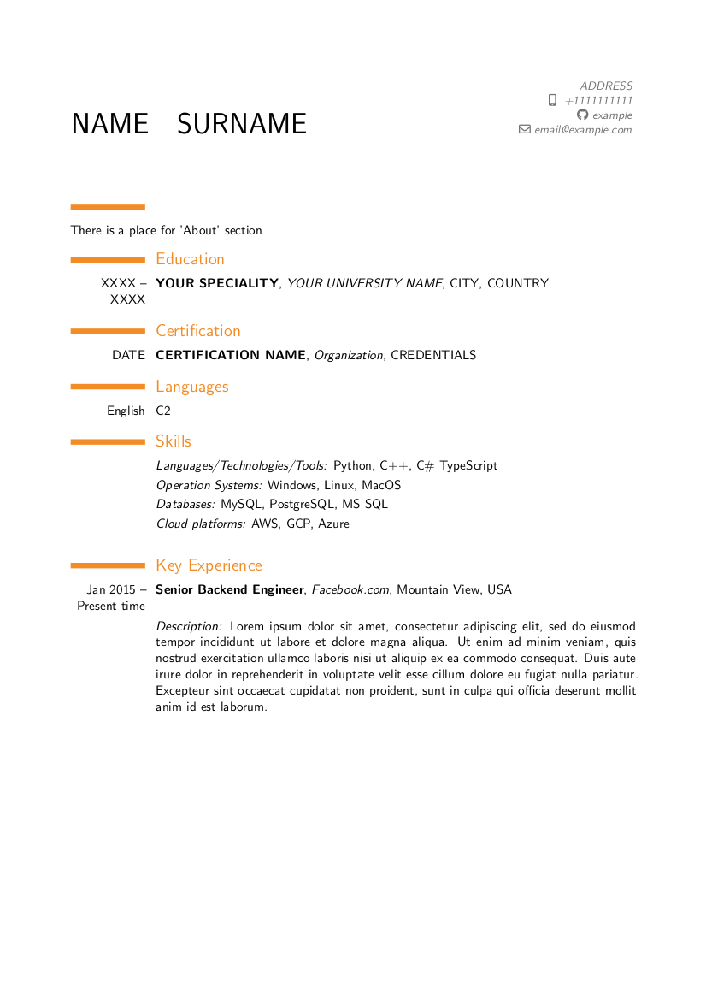

# Latex CV


This is a template for creation of pdf CV using the [moderncv](https://github.com/xdanaux/moderncv) styles.

## Prerequisites
---

You need to have the following packages installed in your system:
- git
- docker
- docker-compose

## Building the CV
---

- Clone this repository and fill the information into **cv.tex** file using default data in it as an example.

- Start the building with the following command:

```shell
docker-compose up 
```

- The resulting **cv.pdf** file will be in the output directory. In a case of any problem please check the output information in terminal or **cv.log** file сontent.


## Example of the output
---




